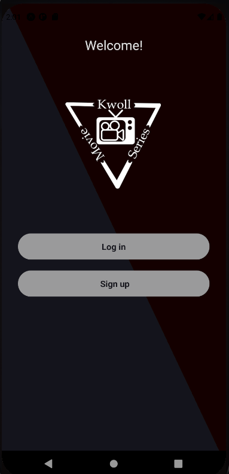
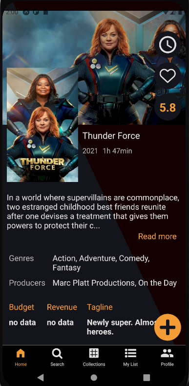
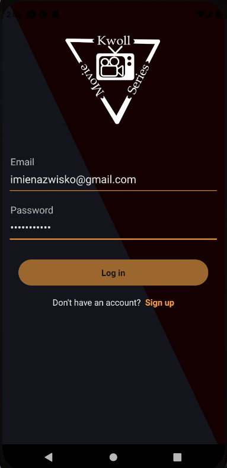
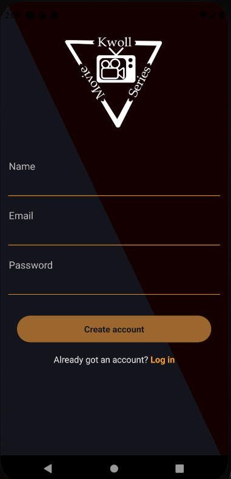

# MovieApp

## Use Application
To check the application, just download Expo Go to your phone and scan the code below. 

# Documentation
----------------------------------------------------------------------------------------------

A mobile application for watching movies and series. Created in React Native technology with the use of Firebase. 
The appearance was designed in accordance with the principles of Material Design. Using The Movie Database API. 

## Login and Registration
Registration is required to use the application. 

## Home 

